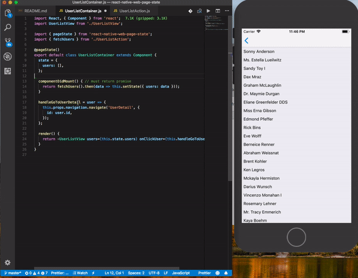
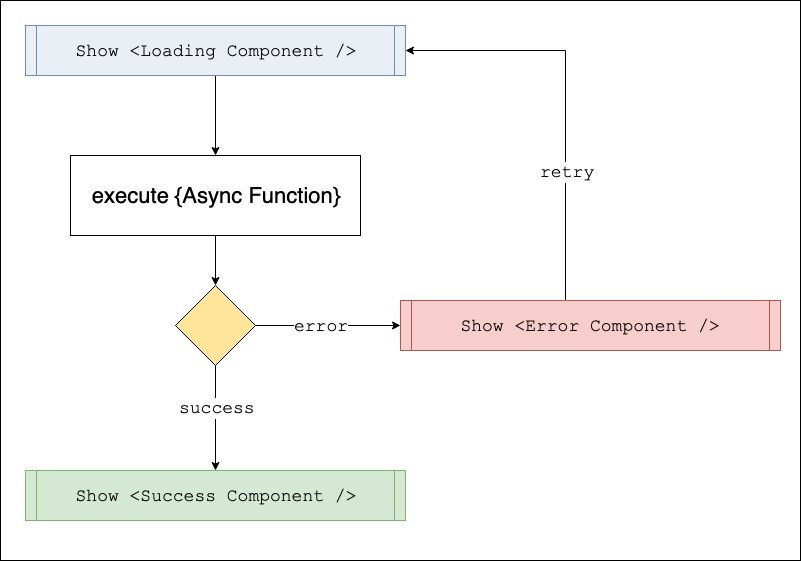

# React Page State
[](https://circleci.com/gh/traveloka/rps)

Handling loading, error, and success callback of promise out of the box!



* * *

## Table of contents

- [React Page State](#react-page-state)
  - [Table of contents](#table-of-contents)
  - [Motivation](#motivation)
  - [How to use](#how-to-use)
      - [Setup](#setup)
  - [Documentations](#documentations)
      - [States](#states)
        - [loading](#loading)
        - [error](#error)
        - [Success](#success)
      - [Components](#components)
      - [HOCs](#hocs)
        - [withPageStateProvider](#withpagestateprovider)
        - [pageState](#pagestate)
  - [Project Example](#project-example)
      - [App](#app)
      - [Web](#web)
  - [Pass additional property to StateComponent](#pass-additional-property-to-statecomponent)
  - [How to (not) use decorators](#how-to-not-use-decorators)
  - [Babel: manually enabling decorators](#babel-manually-enabling-decorators)
  - [Contributing](#contributing)
---
## Motivation
>“The best products don’t focus on features, they focus on clarity.”
— Jon Bolt

Showing loading state, error, and success callback is common in any application. 

In ES6, there's a [Promise](https://www.datchley.name/es6-promises/) that do some async function. Lot of redundant code being used to show the loading before the async function executed, and show error / success state when async function is done.

This library will handle before and after execution of async function by separate the load in another place.



## How to use

#### Setup
using npm:
````
npm install @traveloka/rps --save
````
using yarn:
````
yarn add @traveloka/rps
````

Brief usage:
- With decorator
````javascript
import React from 'react';
import { withPageStateProvider, pageState } from '@traveloka/rps';
import {
  PageLoading,
  PageError,
  SnackbarSuccess,
} from 'project/ui';

const config = {
  page: {
    fullLoading: PageLoading,
    fullError: PageError,
  },
  snackbar: {
    successType: SnackbarSucces,
  }
};

@withPageStateProvider(config)
@pageState()
export default class UserListPage extends React.Component {

  @pageState({
    loading: 'page.fullLoading',
    error: 'page.fullError',
    success: 'snackbar.successType'
  })
  componentDidMount() {
    return fetchUserList();
  }
}
````
- Without decorator
````javascript
import React from 'react';
import { withPageStateProvider, pageState } from '@traveloka/rps';
import {
  PageLoading,
  PageError,
  SnackbarSuccess,
  decorate,
} from 'project/ui';
import compose from 'lodash/fp/compose'; // https://hackernoon.com/function-composition-with-lodash-d30eb50153d1

const config = {
  page: {
    fullLoading: PageLoading,
    fullError: PageError,
  },
  snackbar: {
    successType: SnackbarSucces,
  }
};

class UserListPage extends React.Component {
  componentDidMount() {
    return fetchUserList();
  }
}

decorate(UserListPage, {
  componentDidMount: pageState({
    loading: 'page.fullLoading',
    error: 'page.fullError',
    success: 'snackbar.successType'
  }),
})

export default compose(
  withPageStateProvider(config),
  pageState(),
)(UserListPage);
````

## Documentations

#### States
There are 3 core States: `loading`, `error` and `success`. Each State have it's own order of execution and additional props.

State is being used in [`@pageState`](#pagestate) decorator in class method. It is used to show such event in according order. ex: you want to show Full Loading Page, before function being executed, you should use `loading` State.

Structure:
```javascript
@withPageStateComponent({
  [path]: [StateComponent] // declaration of all available path
})
@pageState({
  [state]: [path] // state must be one of [loading, error, success]
})
componentDidMount() {
  // ...
}

```

##### loading
- `loading` have order **before** async function is executed.

Additional Props:

| Property   | Type   | Default Value | Description                            |
|------------|--------|---------------|----------------------------------------|
| `cancel`     | `func`   |               | To cancel the function execution. `NOTE! Still on experiment.`            |

##### error
- `error` have order **after** async function is executed.
- `error` will be execute, if the async function throw an error exception.

Additional Props:

| Property | Type   | Default Value | Description                                                                                                  |
|----------|--------|---------------|--------------------------------------------------------------------------------------------------------------|
| `error`    | `object` |               | An error object that being throw in async function                                                           |
| `retry`    | `func`   |               | Function that would execute async function. Function that being executed will have same parameter as before. |

##### Success
- `success` have order **after** async function is executed.
- `success` will be execute, if the async function not throw an error exception.

Additional Props:

| Property | Type | Default Value | Description                                      |
|----------|------|---------------|--------------------------------------------------|
| `result`   | any  |               | Value that being resolve by async function. |

---

#### Components
See in [COMPONENTS](docs/COMPONENTS.md)

---

#### HOCs

##### withPageStateProvider

+ `withPageStateProvider(stateConfig)`

`withPageStateProvider` HOC is a shortcut to wrap the React Component with `PageStateProvider`.

Structure of `stateConfig`:
```javascript
{
  [path: string]: [StateComponent: ReactElement]
}
```
Example:
```javascript
{
  loading: (props) => <div>Loading...</div>
}
```

##### pageState
`pageState` HOC is being used in React Class Component and Class Method.
1. `pageState` as HOC in React Class Component, is a shortcut to wrap the React Component with `PageStateConsumer`.
2. `pageState` as HOC in Class Method, this trigger the state to being show before / after the method being executed.
   + `pageState(config)`.
      + `config`, there are 2 structures that could being pass in config.
        1. Basic.
           structure:
           ```javascript
           @pageState({
             [state: (loading|error|success)]: [path: string]
           })
           ```
           example:
           ```javascript
           @pageState({
             loading: 'page.loading'
           })
           ```
        2. Customizeable, giving flexibility to pass additional property to state component.
           structure:
           ```javascript
           @pageState({
             [state: (loading|error|success)]: {
               path: [path: string],
               payload: [additional_property: object]
             }
           })
           ```
           example:
           ```javascript
           @pageState({
             loading: {
               path: 'page.fullLoading',
               payload: {
                 title: 'Waiting...'
               }
             }
           })
           ```

## Project Example
````bash
yarn
yarn bootstrap
````

#### App
````bash
cd examples/apps
yarn start
react-native run-ios # open another terminal
````

#### Web
````bash
cd examples/web
yarn start
````
## Pass additional property to StateComponent
To have flexibility passing additional property to StateComponent, in `pageState` HOC in Class Method, you must pass StateComponent.
Example:
```javascript
// Loading.js
export default function Loading({title}) {
  return (<div>{title}</div>)
}
----------

// Container.js
import {
  withPageStateProvider,
  pageState
} from '@traveloka/rps';
import Loading from './Loading';

@withPageStateProvider({
  loading: Loading
})
@pageState
export default class Container extends React.Component {

  @pageState({
    path: 'loading',
    payload: {
      title: 'Please wait...',
    }
  })
  componentDidMount() {
    //...
  }
}
```

## How to (not) use decorators

Using ES.next decorators is optional. This section explains how to use them, or how to avoid them.

Advantages of using decorators:

* Minimizes boilerplate, declarative.
* Easy to use and read. A majority of the MobX users use them.

Disadvantages of using decorators:

* Stage-2 ES.next feature
* Requires a little setup and transpilation, only supported with Babel / Typescript transpilation so far

You can approach using decorators in two ways:

* Enable the currently experimental decorator syntax in your compiler (read on)
* Don't enable decorator syntax, but leverage the built-in utility decorate to apply decorators to your classes / objects.

Using decorator syntax:

```javascript
import { withPageStateProvider, pageState } from '@traveloka/rps';

@withPageStateProvider()
@pageState()
class Timer extends React.Component {

  @pageState({ loading: 'modal.loading' })
  componentDidMount() {
    /* ... */
  }

  render() {
    /* ... */
  }
}
```

Using the `decorate` utility:

```javascript
import compose from 'lodash/fp/compose';
import {
  withPageStateProvider,
  pageState,
  decorate
} from '@traveloka/rps';

class Timer extends React.Component {
  componentDidMount() {
    /* ... */
  }

  render() {
    /* ... */
  }
}

// decorate method
decorate(Timer, {
  componentDidMount: pageState({ loading: 'modal.loading' }),
});

export default compose(
  withPageStateProvider(),
  pageState()
)(Timer);
```
## Babel: manually enabling decorators

To enable support for decorators, follow the following steps. Install support for decorators: `npm i --save-dev babel-plugin-transform-decorators-legacy`. And enable it in your `.babelrc` file:

```
{
  "presets": [
    "es2015",
    "stage-1"
  ],
  "plugins": ["transform-decorators-legacy"]
}
```

Note that the order of plugins is important: `transform-decorators-legacy` should be listed first. Having issues with the babel setup? Check this [issue](https://github.com/mobxjs/mobx/issues/105) first.

For babel 7, see issue [1352](https://github.com/mobxjs/mobx/issues/1352) for an example setup.


## Contributing

See [CONTRIBUTING.md](docs/CONTRIBUTING.md)